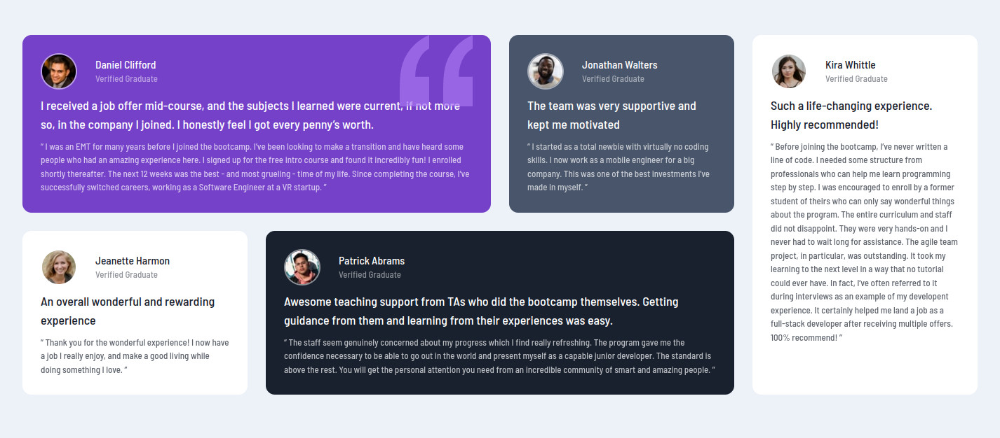

# Frontend Mentor - Testimonials grid section solution

This is a solution to the [Testimonials grid section challenge on Frontend Mentor](https://www.frontendmentor.io/challenges/testimonials-grid-section-Nnw6J7Un7). Frontend Mentor challenges help you improve your coding skills by building realistic projects. 

## Table of contents

- [Overview](#overview)
  - [The challenge](#the-challenge)
  - [Screenshot](#screenshot)
- [My process](#my-process)
  - [Built with](#built-with)
  - [What I learned](#what-i-learned)
  - [Continued development](#continued-development)

## Overview

### The challenge

Users should be able to:

- View the optimal layout for the site depending on their device's screen size

### Screenshot

## My process

### Built with

- CSS custom properties
- CSS Grid
- Mobile-first workflow

### What I learned

This was my first ever grid project! The trickiest part was when the cards within the same row were refusing to be the same height and somehow I couldn't google the answer instantly. But then I realized I should have set the height to 100% and boom, problem fixed.

I also learned quite a bit about the z-index.

### Continued development

Learn more grid stuff!

